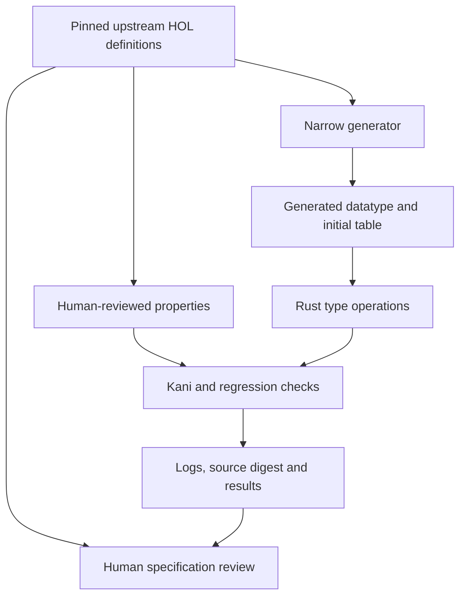

# Architecture description AD-001

Status: initial implementation baseline. Entity of interest: Candle-rs, including
its Rust kernel, generation tools and independent verification workflow.

This description uses the stakeholder, concern, viewpoint, view and correspondence
concepts of [ISO/IEC/IEEE 42010:2022](https://www.iso.org/standard/74393.html).
It is not a certification or an assertion of complete standard conformance.
ADRs record decisions within this architecture description; ADRs alone do not
replace its stakeholder/viewpoint model.

## Purpose and environment

The project goal is observable behavior matching the intended Candle specification,
with a checked Rust refinement. The original Candle end-to-end theorem does not
automatically apply to this port. Its relevant source layers are distinct:

| Layer | Source of truth | Current use |
| --- | --- | --- |
| User interface and proof scripts | `CakeML/candle`, pinned revision | Scope and API reference |
| Monadic kernel operations | `CakeML/cakeml/candle/standard/monadic/holKernelScript.sml` | Primary behavior specification for this slice |
| HOL inference system | `candle/standard/syntax/holSyntaxScript.sml` | Intended syntax and future refinement target |
| Kernel translation and initial state | `candle/standard/ml_kernel/` | Datatype/table extraction and future proof-reuse study |
| Semantics/soundness | `candle/standard/semantics/` | Future source of semantic obligations; not a Rust proof |

Exact commits, file paths, Git blob IDs and SHA-256 hashes are in the lock file.
The two independently pinned upstream revisions are references, not a claim that
we reproduced a compatible upstream executable build at those revisions.

## Stakeholders and concerns

| ID | Stakeholder | Concern | Acceptance evidence |
| --- | --- | --- | --- |
| C1 | Solo supervising engineer | Review more work without trusting agent summaries | Reproducible commands, source digest, input domains, negative controls |
| C2 | Proof engineer | The Rust function satisfies the intended mathematical specification | Upstream definition links; bounded properties now; unbounded refinement open |
| C3 | Maintainer / implementing agent | Reuse work and avoid repeated rediscovery or errors | Pinned sources, generated inventory, ADRs, stable regression IDs |
| C4 | Future theorem-prover user | Accepted theorems are sound and scripts behave correctly | Opaque theorem API, context invariants, inference proofs and differential replay, all pending |
| C5 | Contributor / distributor | Provenance and obligations remain visible | Original project license, upstream notices, byte-exact input checks |

## Viewpoints and model conventions

| Viewpoint | Concerns | Model kind and analysis rule | Current view |
| --- | --- | --- | --- |
| Behavior | C2, C4 | Definition-to-function mapping; success value, failure bytes and state transition must agree | `spec/implementation.json`, generated inventory, type tests |
| Verification | C1, C2 | Claim/domain/assumption/evidence tuple; no implication from bounded to unbounded | `spec/obligations.json`, Kani harnesses, evidence JSON |
| Construction | C3, C5 | Dependency graph; generated outputs require pinned input and deterministic regeneration | Diagram below, lock file, `tools/repo.py` |
| Operations and supervision | C1, C3 | Repeatable check sequence; missing evidence must fail visibly | `tools/verify.py`, CI lanes, negative controls |
| Evolution | C2, C3, C4 | ADR plus prerequisite/acceptance gate per milestone | `docs/adr/`, `docs/status.md` |

## Construction and trust view

Generated code, manual code, test code and build code are all untrusted inputs to
review. Kani, CBMC, their models, Rust compiler integration, the operating system
and hardware are part of the present verification trust base. The stable runtime
additionally relies on rustc/LLVM and the standard library. Source checks are not
proofs about emitted machine instructions.

Checksums detect unexpected drift relative to the reviewed lock file. An agent
that edits the lock file, code and assertions together can still manufacture a
green workflow. Independent supervision therefore includes reviewing changes to
the checker and comparing pins against upstream. A report cannot authenticate
itself against a malicious report producer.

## Behavior view for the first slice

The observable contract is raw HOL syntax plus a projection of the type-constant
state. Names are arbitrary bytes. Lists preserve their upstream order. Errors
carry exact monadic-kernel failure bytes; UI formatting of those bytes is separate.
Arity is a HOL natural representable by the platform's `usize`.

`add_type` rejects existing names and prepends new names. Every returned failure
leaves all represented state unchanged. This is operation atomicity in a single
thread, not a concurrency or crash-durability guarantee. There is no async runtime,
global mutable state, unsafe block or shared atomic structure.

`mk_type` has the monadic definition's raw syntax domain: it checks the outer
constructor and arity. It does not certify recursive `type_ok`. Runtime checks at
Candle's external language boundary are a separate future component. Raw public
type syntax cannot construct a theorem because no theorem-producing API exists.

`type_subst` substitutes only variables, in `(replacement, target)` orientation.
It selects the first equal target and inserts the replacement unchanged. It
traverses application arguments in order; non-variable targets have no effect.

## Correspondences and inconsistencies

- Each implemented definition maps to a Rust item in `spec/implementation.json`.
  Definitions not mapped stay visible as unimplemented in the generated inventory.
- Each Kani harness has an ID, domain, source definitions and unwind bound in the
  manifest. CI rejects missing, extra or differently bounded harnesses.
- The generator reads byte-verified upstream snapshots; CI regenerates in memory
  and compares outputs. Input/expected-output tests are separately maintained.
- Source folders have identical instruction copies; CI checks tracked and new
  nonignored files rather than traversing compiler caches.
- Known gaps are explicit: finite machine arities, bounded proof domains, recursive
  resource behavior, missing full context, missing terms/theorems/interpreter,
  absent whole-system equivalence and binary proof. No current view resolves them.

## Decision rationale

[ADR-0001](adr/0001-specification-and-scope.md) chooses the specification boundary.
[ADR-0002](adr/0002-generation-and-evidence.md) chooses generation and evidence
mechanisms. [ADR-0003](adr/0003-shared-hol-contract-and-reuse.md) fixes the shared
HOL contract and verifier-source reuse boundary. Proposed changes to trust, representation, accepted domains or proof
claims require an ADR update with new evidence and unresolved consequences.
